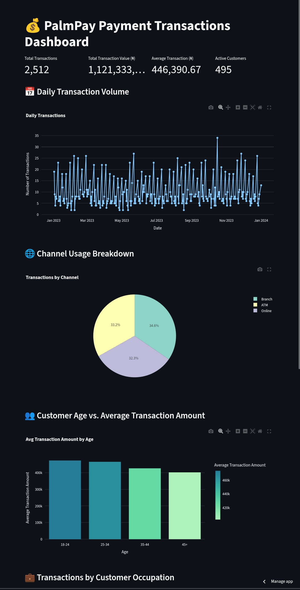

# PalmPay Transactions Insights & Fraud Detection Dashboard

<p align="center">
  <a href="https://customersegmentation-ddtbrggn9mfzd6p4heevks.streamlit.app/" target="_blank">
    
  </a>
  <a href="https://customersegmentation-ddtbrggn9mfzd6p4heevks.streamlit.app/" target="_blank">
    
  </a>
</p>


Welcome to the **PalmPay Transactions Insights Dashboard**—an interactive and visually engaging analytics platform designed to help fintech teams uncover actionable insights from transaction data, detect potential fraud, and optimize business strategies (Note: this Dashboard was designed eith fictitious Palmpay data).

## 📅 Project Overview

This dashboard showcases deep analysis of transaction patterns from a simulated PalmPay dataset, featuring:

* Daily transaction trends
* Channel performance breakdown
* Customer behavior insights by age and occupation
* Fraud risk detection using anomaly flags

Built using **Streamlit** and **Plotly**, this solution demonstrates how data can be transformed into clear, impactful decision-making tools.

## 📊 Key Features

| Feature                       | Description                                                      |
| ----------------------------- | ---------------------------------------------------------------- |
| 📲 **Channel Analysis**       | Identify how customers prefer to transact (MobileApp, POS, USSD) |
| 👥 **Customer Segmentation**  | Explore transaction behaviors across age groups and occupations  |
| ⚡ **High-Value Transactions** | Spot outliers in transaction amounts                             |
| 🚨 **Fraud Risk Scoring**     | Flag users with suspicious patterns using multiple indicators    |

## 🛠️ Tech Stack

* **Streamlit**: Interactive web app framework
* **Pandas**: Data manipulation and analysis
* **Plotly Express**: Beautiful, responsive charts

## 📅 How to Run This Project

1. Clone the repository:

   ```bash
   git clone https://github.com/yourusername/palmpay-dashboard.git
   cd palmpay-dashboard
   ```

2. Install the requirements:

   ```bash
   pip install -r requirements.txt
   ```

3. Run the app:

   ```bash
   streamlit run app.py
   ```

4. Or deploy it for free on [Streamlit Cloud](https://streamlit.io/cloud).

## 🌟 Insights & Impact

* Identify user segments that drive transaction volume.
* Highlight risky behaviors that may require intervention.
* Provide management teams with clear visualizations to guide strategy.

## 🚀 Project Goals

This project demonstrates how advanced **data storytelling** combined with **fraud risk monitoring** can enhance customer experience, security, and operational efficiency in the fintech industry—tailored specifically to showcase the value I can bring to **PalmPay**.

---

> "Data that isn't used to make decisions is data wasted. This dashboard turns numbers into action."
